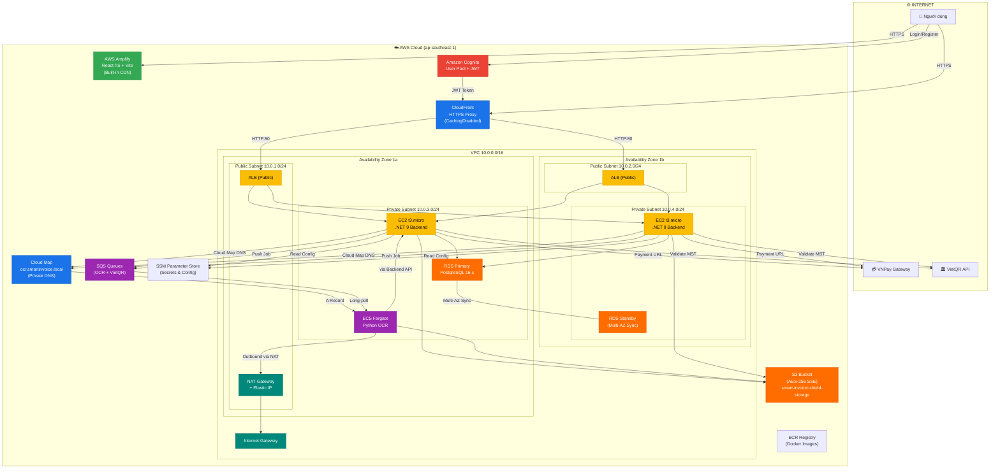
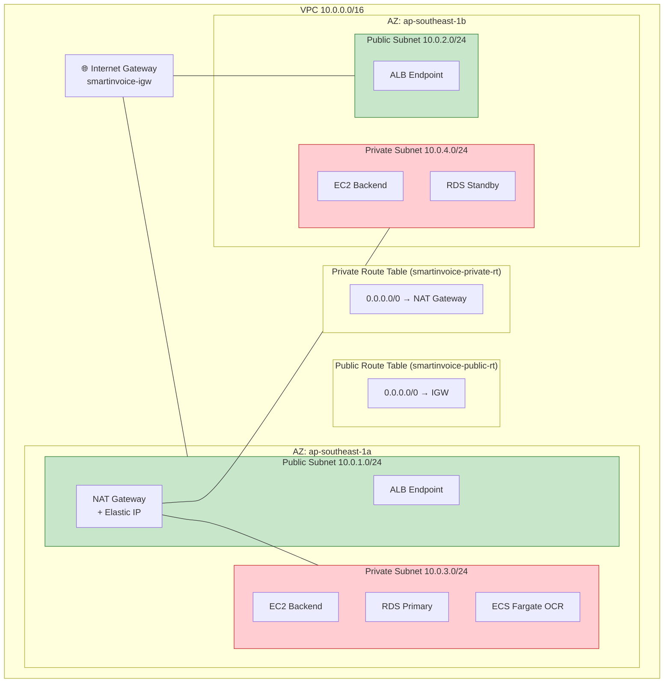
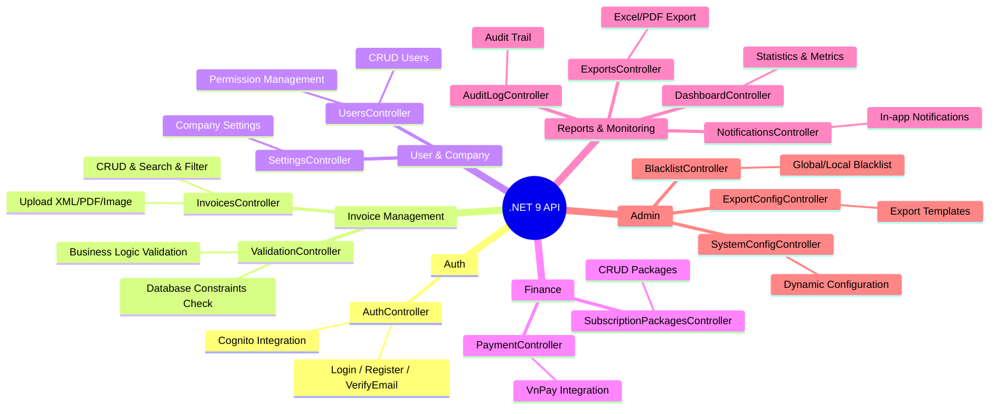
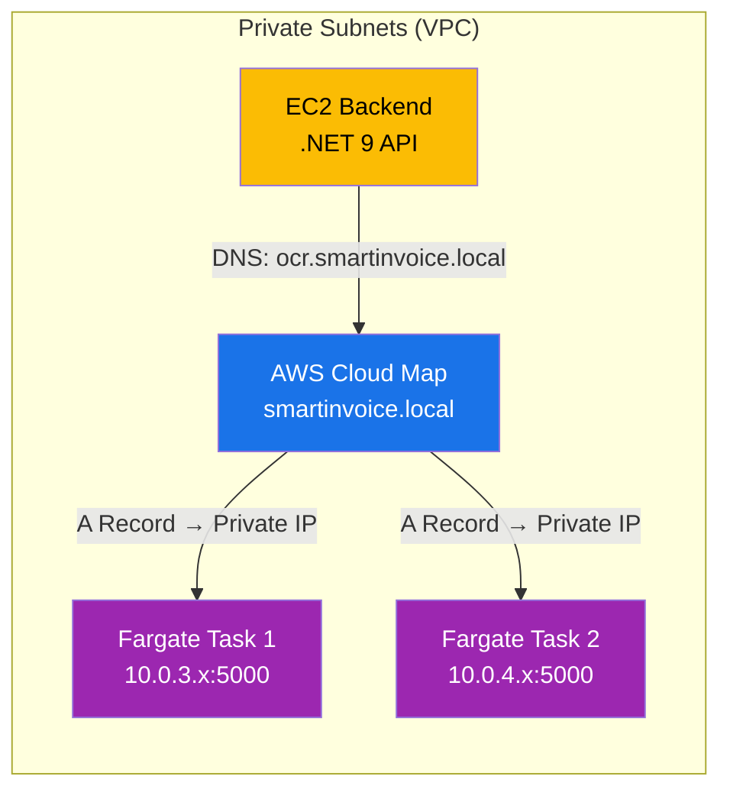
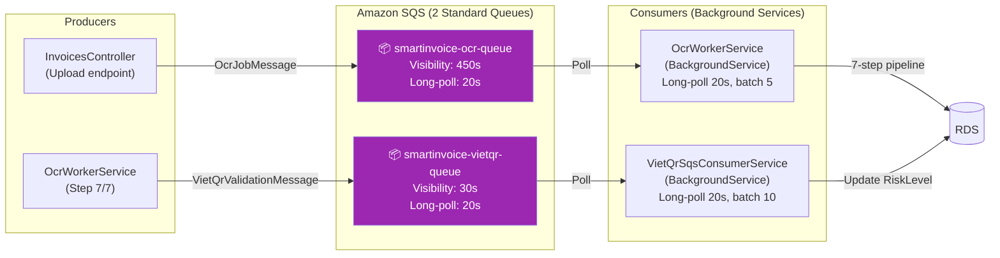
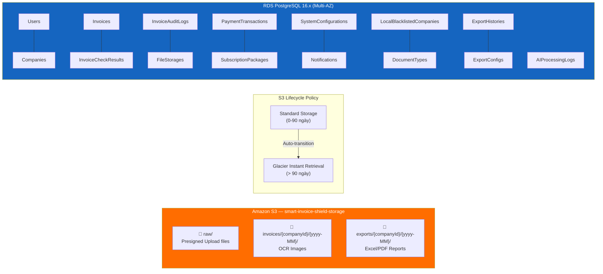
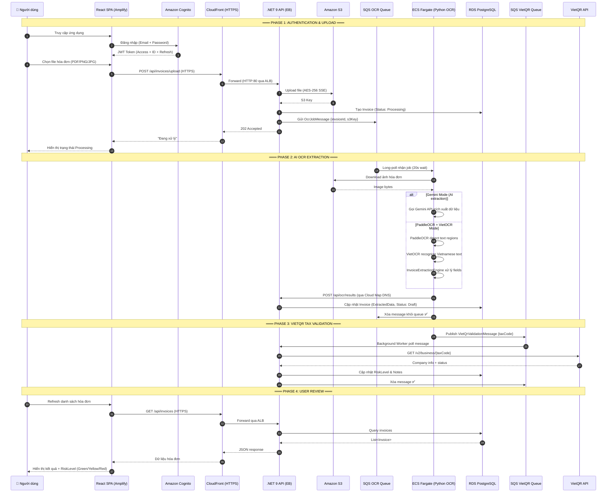
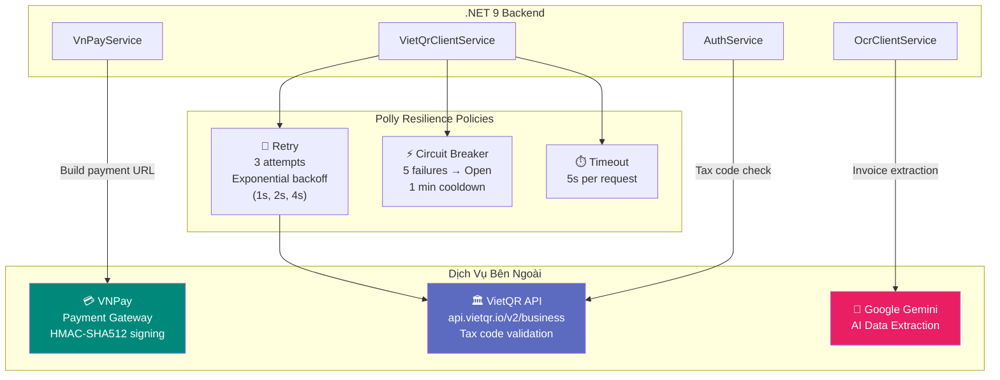
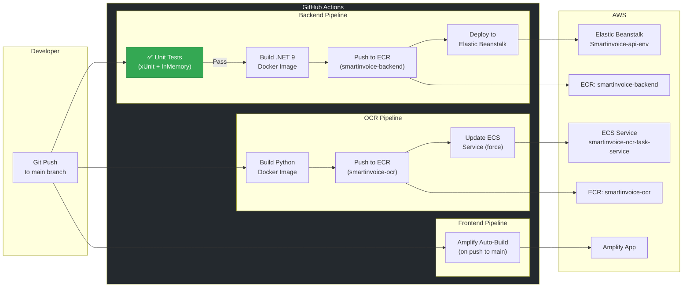

# TÀI LIỆU KIẾN TRÚC AWS - SMARTINVOICE SHIELD

## MỤC LỤC

1. [Tổng quan hệ thống](#1-tổng-quan-hệ-thống)
2. [Sơ đồ kiến trúc tổng thể](#2-sơ-đồ-kiến-trúc-tổng-thể)
3. [Thiết kế mạng (VPC & Networking)](#3-thiết-kế-mạng-vpc--networking)
4. [Chi tiết các tầng dịch vụ](#4-chi-tiết-các-tầng-dịch-vụ)
5. [Luồng xử lý hóa đơn (Sequence Diagram)](#5-luồng-xử-lý-hóa-đơn-sequence-diagram)
6. [Mô hình bảo mật nhiều tầng](#6-mô-hình-bảo-mật-nhiều-tầng)
7. [Tích hợp bên ngoài & Resilience](#7-tích-hợp-bên-ngoài--resilience)
8. [CI/CD Pipeline](#8-cicd-pipeline)
9. [Giám sát & Cảnh báo](#9-giám-sát--cảnh-báo)
10. [Chiến lược tối ưu chi phí](#10-chiến-lược-tối-ưu-chi-phí)
11. [Ước tính chi phí hàng tháng](#11-ước-tính-chi-phí-hàng-tháng)

---

## 1. TỔNG QUAN HỆ THỐNG

### 1.1. Mục tiêu thiết kế

| Tiêu chí                               | Mô tả                                                                                            |
| -------------------------------------- | ------------------------------------------------------------------------------------------------ |
| **Tối ưu chi phí (Cost-Optimization)** | Sử dụng Cloud Map thay ALB nội bộ, Free Tier tối đa, Fargate pay-as-you-go, S3 Lifecycle         |
| **Đa vùng sẵn sàng (Multi-AZ)**        | RDS Multi-AZ Standby, Backend rải 2 AZ, ALB health check tự động                                 |
| **Bảo mật (Security)**                 | Toàn bộ workload trong Private Subnet, NAT Gateway cho outbound, SSM Parameter Store, S3 AES-256 |
| **Khả năng mở rộng (Scalability)**     | Auto Scaling cho Backend (2-4 instances), ECS Fargate scale theo nhu cầu                         |

### 1.2. Công nghệ cốt lõi

| Tầng                  | Công nghệ                          | Dịch vụ AWS                       |
| --------------------- | ---------------------------------- | --------------------------------- |
| **Frontend**          | React TypeScript + Vite            | AWS Amplify (Built-in CDN)        |
| **Backend API**       | .NET 9 Web API                     | Elastic Beanstalk (Docker on EC2) |
| **AI / OCR**          | Python, PaddleOCR, VietOCR, Gemini | ECS Fargate                       |
| **Database**          | PostgreSQL 16.x                    | Amazon RDS (Multi-AZ)             |
| **Object Storage**    | —                                  | Amazon S3 (AES-256 SSE)           |
| **Message Queue**     | —                                  | Amazon SQS (Standard)             |
| **Authentication**    | JWT                                | Amazon Cognito (User Pool)        |
| **Service Discovery** | —                                  | AWS Cloud Map (Private DNS)       |
| **HTTPS Proxy**       | —                                  | Amazon CloudFront                 |

---

## 2. SƠ ĐỒ KIẾN TRÚC TỔNG THỂ

---

## 3. THIẾT KẾ MẠNG (VPC & NETWORKING)

### 3.1. Tổng quan VPC

| Thành phần             | Giá trị                      |
| ---------------------- | ---------------------------- |
| **VPC Name**           | `smartinvoice-vpc`           |
| **CIDR Block**         | `10.0.0.0/16` (65,536 IPs)   |
| **Region**             | `ap-southeast-1` (Singapore) |
| **Availability Zones** | 2 AZs (`1a`, `1b`)           |
| **Subnets**            | 4 (2 Public + 2 Private)     |

### 3.2. Bảng Subnet chi tiết

| Subnet                    | CIDR          | AZ  | Loại        | Workload                              |
| ------------------------- | ------------- | --- | ----------- | ------------------------------------- |
| `smartinvoice-public-1a`  | `10.0.1.0/24` | 1a  | **Public**  | ALB, NAT Gateway                      |
| `smartinvoice-public-1b`  | `10.0.2.0/24` | 1b  | **Public**  | ALB                                   |
| `smartinvoice-private-1a` | `10.0.3.0/24` | 1a  | **Private** | EC2 Backend, RDS Primary, ECS Fargate |
| `smartinvoice-private-1b` | `10.0.4.0/24` | 1b  | **Private** | EC2 Backend, RDS Standby              |

### 3.3. Sơ đồ mạng chi tiết

### 3.4. Security Groups

| Security Group                | Inbound Rules                                 | Mô tả                                     |
| ----------------------------- | --------------------------------------------- | ----------------------------------------- |
| **`smartinvoice-alb-sg`**     | TCP 80, 443 từ `0.0.0.0/0`                    | ALB tiếp nhận traffic từ Internet         |
| **`smartinvoice-backend-sg`** | TCP 80, 8080 từ `alb-sg`; All Traffic từ Self | EC2 Backend chỉ nhận traffic từ ALB       |
| **`smartinvoice-rds-sg`**     | TCP 5432 từ `backend-sg`, `ocr-sg`            | RDS chỉ cho phép Backend và OCR kết nối   |
| **`smartinvoice-ocr-sg`**     | TCP 5000 từ `backend-sg`                      | OCR Container chỉ nhận request từ Backend |

> **Tất cả Security Groups**: Outbound = All traffic → `0.0.0.0/0`

### 3.5. Route Tables

| Route Table               | Routes                         | Associated Subnets         |
| ------------------------- | ------------------------------ | -------------------------- |
| `smartinvoice-public-rt`  | `0.0.0.0/0` → Internet Gateway | `public-1a`, `public-1b`   |
| `smartinvoice-private-rt` | `0.0.0.0/0` → NAT Gateway      | `private-1a`, `private-1b` |

---

## 4. CHI TIẾT CÁC TẦNG DỊCH VỤ

### 4.1. Tầng Edge & CDN

| Dịch vụ               | Vai trò                       | Cấu hình                                                                                                                                                                             |
| --------------------- | ----------------------------- | ------------------------------------------------------------------------------------------------------------------------------------------------------------------------------------ |
| **AWS Amplify**       | Hosting SPA (React TS + Vite) | Auto-build từ GitHub `main` branch, Built-in CDN toàn cầu                                                                                                                            |
| **Amazon CloudFront** | HTTPS Proxy cho Backend API   | Origin: EB ALB (HTTP:80), Viewer: Redirect HTTP→HTTPS, Cache: `CachingDisabled`, Origin Request: `AllViewerExceptHostHeader`, Response: `CORS-With-Preflight`, Rate limiting enabled |

### 4.2. Tầng Xác Thực

| Dịch vụ            | Vai trò           | Cấu hình                                                                                                                                             |
| ------------------ | ----------------- | ---------------------------------------------------------------------------------------------------------------------------------------------------- |
| **Amazon Cognito** | Identity Provider | User Pool, Email sign-in, Self-registration, Custom attributes (`company_id`, `role`), `ALLOW_USER_PASSWORD_AUTH`, JWT Token (Access + ID + Refresh) |

### 4.3. Tầng Backend (Application)

| Dịch vụ               | Vai trò                | Cấu hình                                                                                                      |
| --------------------- | ---------------------- | ------------------------------------------------------------------------------------------------------------- |
| **Elastic Beanstalk** | .NET 9 Web API Runtime | Docker on 64bit Amazon Linux 2023, Single Instance → Auto Scaling (2-4 `t3.micro`), Private Subnet deployment |
| **ALB**               | Load Balancer          | Multi-AZ, Health check, Public Subnet, Traffic distribution                                                   |
| **Auto Scaling**      | High Availability      | Min: 2 instances, Max: 4 instances, rải đều 2 AZs                                                             |

**14 API Controllers đã triển khai:**

### 4.4. Tầng AI / OCR (ECS Fargate)

| Thành phần            | Cấu hình                                                                      |
| --------------------- | ----------------------------------------------------------------------------- |
| **ECS Cluster**       | `smartinvoice-cluster` (Fargate only)                                         |
| **Task Definition**   | `smartinvoice-ocr-task`, Linux/X86_64, 2 vCPU, 4 GB RAM                       |
| **Service**           | `smartinvoice-ocr-task-service`, Desired: 2 tasks, Rolling update             |
| **Container**         | `ocr-container`, Port 5000, `DEVICE=cpu`, `HOST=0.0.0.0`                      |
| **Networking**        | Private Subnets, No Public IP, `smartinvoice-ocr-sg`                          |
| **Service Discovery** | Cloud Map namespace `smartinvoice.local`, Service `ocr`, A record, TTL 15-60s |
| **Task Role**         | `smartinvoice-ecs-task-role` (S3, SQS, SSM)                                   |
| **Execution Role**    | `ecsTaskExecutionRole` (ECR pull, CloudWatch logs)                            |
| **Logs**              | CloudWatch `awslogs` → `/ecs/smartinvoice-ocr-task`                           |

#### Giao tiếp Backend ↔ OCR (Cloud Map Service Discovery)

> **Lý do chọn Cloud Map thay vì Internal ALB**: Tiết kiệm ~$18/tháng chi phí Load Balancer nội bộ. Backend gọi trực tiếp OCR qua DNS nội bộ `http://ocr.smartinvoice.local:5000`.

### 4.5. Tầng Xử Lý Bất Đồng Bộ (Event-Driven)

| Thành phần                   | Chi tiết kỹ thuật                                                                                                             |
| ---------------------------- | ----------------------------------------------------------------------------------------------------------------------------- |
| **SQS OCR Queue**            | Standard, Visibility timeout 450s, Long-polling 20s, batch 5 messages                                                         |
| **SQS VietQR Queue**         | Standard, Visibility timeout 30s, Long-polling 20s, batch 10 messages                                                         |
| **OcrWorkerService**         | 7-step pipeline: Download S3 → Call OCR API → Validate Logic → Extract Data → Create FileStorage → Update DB → Publish VietQR |
| **VietQrSqsConsumerService** | DI scope isolation per message, Polly retry (3×, exponential backoff) + Circuit Breaker (5 failures → 1 min break)            |

### 4.6. Tầng Lưu Trữ & Database

| Dịch vụ             | Cấu hình                                                                                                                                           |
| ------------------- | -------------------------------------------------------------------------------------------------------------------------------------------------- |
| **Amazon S3**       | Bucket: `smart-invoice-shield-storage`, Encryption: AES-256 (SSE-S3), **Block all public access**, Presigned URLs (15-60 phút), 3 folder prefix    |
| **S3 Lifecycle**    | Standard → Glacier Instant Retrieval sau 90 ngày                                                                                                   |
| **RDS PostgreSQL**  | Instance: `db.t3.micro`, Engine: PostgreSQL 16.x, Multi-AZ Standby, Private Subnet, Automated Backup 7 ngày, PITR, DB: `SmartInvoiceDb`, 15 tables |
| **DB Subnet Group** | `smartinvoice-db-subnet-group` (2 Private Subnets)                                                                                                 |

### 4.7. Tầng Quản Lý Cấu Hình (SSM Parameter Store)

| Parameter                                  | Type             | Mô tả                                |
| ------------------------------------------ | ---------------- | ------------------------------------ |
| `/SmartInvoice/prod/COGNITO_USER_POOL_ID`  | String           | Cognito User Pool ID                 |
| `/SmartInvoice/prod/COGNITO_CLIENT_ID`     | String           | Cognito App Client ID                |
| `/SmartInvoice/prod/COGNITO_CLIENT_SECRET` | **SecureString** | Cognito App Client Secret            |
| `/SmartInvoice/prod/AWS_SQS_OCR_URL`       | String           | SQS OCR Queue URL                    |
| `/SmartInvoice/prod/AWS_SQS_URL`           | String           | SQS VietQR Queue URL                 |
| `/SmartInvoice/prod/POSTGRES_HOST`         | String           | RDS Endpoint                         |
| `/SmartInvoice/prod/POSTGRES_PORT`         | String           | `5432`                               |
| `/SmartInvoice/prod/POSTGRES_DB`           | String           | `SmartInvoiceDb`                     |
| `/SmartInvoice/prod/POSTGRES_USER`         | String           | `postgres`                           |
| `/SmartInvoice/prod/POSTGRES_PASSWORD`     | **SecureString** | RDS Master Password                  |
| `/SmartInvoice/prod/AWS_REGION`            | String           | `ap-southeast-1`                     |
| `/SmartInvoice/prod/AWS_S3_BUCKET_NAME`    | String           | `smart-invoice-shield-storage`       |
| `/SmartInvoice/prod/OCR_API_ENDPOINT`      | String           | `http://ocr.smartinvoice.local:5000` |
| `/SmartInvoice/prod/ALLOWED_ORIGINS`       | String           | Amplify domain URL                   |

---

## 5. LUỒNG XỬ LÝ HÓA ĐƠN (SEQUENCE DIAGRAM)

### Luồng xử lý tóm tắt (Happy Path)

| Bước                     | Hành động                                                                            | Dịch vụ AWS         |
| ------------------------ | ------------------------------------------------------------------------------------ | ------------------- |
| **1. Xác thực**          | Người dùng đăng nhập, nhận JWT Token                                                 | Cognito             |
| **2. Upload**            | File tải lên qua CloudFront → ALB → Backend → S3 (AES-256)                           | CloudFront, ALB, S3 |
| **3. Queue Job**         | Backend tạo OcrJobMessage, đẩy vào SQS, phản hồi 202 "Đang xử lý"                    | SQS                 |
| **4. AI OCR**            | Fargate pull job, download file S3, chạy PaddleOCR+VietOCR hoặc Gemini               | ECS Fargate, S3     |
| **5. Cập nhật kết quả**  | OCR gọi Backend API (qua Cloud Map DNS) để cập nhật DB                               | Cloud Map, RDS      |
| **6. VietQR Validation** | Publish VietQR message → Background worker gọi API xác thực MST → cập nhật RiskLevel | SQS, VietQR API     |
| **7. Hiển thị**          | Frontend poll/refresh, hiển thị dữ liệu + mức rủi ro                                 | Amplify             |

---

## 6. MÔ HÌNH BẢO MẬT NHIỀU TẦNG

```mermaid
graph TB
    subgraph L1["Layer 1: Edge Security"]
        HTTPS["HTTPS Everywhere<br/>(CloudFront + ACM)"]
        CDN["CDN + DDoS Protection<br/>(Amplify Built-in)"]
        RATE["Rate Limiting<br/>(CloudFront WAF)"]
    end

    subgraph L2["Layer 2: Authentication & Authorization"]
        JWT["Cognito JWT Tokens<br/>(Access + ID + Refresh)"]
        CLAIMS["Custom Claims Transformer<br/>(Role + Permissions → Claims)"]
        RBAC["Role-Based Access Control<br/>(SuperAdmin, CompanyAdmin,<br/>Accountant, Viewer)"]
    end

    subgraph L3["Layer 3: Network Isolation"]
        VPC_L["VPC Isolation<br/>(10.0.0.0/16)"]
        SG["Security Groups<br/>(4 SGs, Strict Inbound Rules)"]
        PRIV["Private Subnets<br/>(All workloads: Backend, RDS, ECS)"]
        NAT_L["NAT Gateway<br/>(Controlled Outbound Only)"]
    end

    subgraph L4["Layer 4: Data Protection"]
        S3_ENC["S3 AES-256 SSE<br/>(Block All Public Access)"]
        RDS_ENC["RDS Encryption at Rest"]
        SSM_L["SSM Parameter Store<br/>(SecureString for secrets)"]
        PRESIGN["Presigned URLs<br/>(Time-limited S3 access)"]
    end

    subgraph L5["Layer 5: Application Security"]
        MAINT["Maintenance Middleware"]
        CORS_L["CORS Policy<br/>(Amplify origin only)"]
        PERM["Permission-based Policies<br/>(14 granular permissions)"]
    end

    L1 --> L2 --> L3 --> L4 --> L5

    style L1 fill:#1a73e8,color:white
    style L2 fill:#ea4335,color:white
    style L3 fill:#34a853,color:white
    style L4 fill:#fbbc04,color:black
    style L5 fill:#9c27b0,color:white
```

### Điểm nổi bật về bảo mật

| Tầng        | Biện pháp        | Chi tiết                                                  |
| ----------- | ---------------- | --------------------------------------------------------- |
| **Edge**    | HTTPS bắt buộc   | CloudFront redirect HTTP → HTTPS, ACM certificates        |
| **Edge**    | Rate Limiting    | CloudFront WAF chống DDoS/Spam API                        |
| **Auth**    | JWT + RBAC       | 4 roles, 14 permissions, Custom Claims Transformer        |
| **Network** | Private Subnets  | Backend, RDS, ECS Fargate **tất cả** trong Private Subnet |
| **Network** | Security Groups  | 4 SGs với inbound rules nghiêm ngặt (least privilege)     |
| **Network** | NAT Gateway      | Outbound-only Internet access cho Private Subnets         |
| **Data**    | Encryption       | S3 AES-256, RDS encryption at rest                        |
| **Data**    | No Public S3     | Block all public access, chỉ Presigned URLs               |
| **Data**    | SSM SecureString | Secrets (passwords, client secrets) mã hóa KMS            |
| **App**     | CORS strict      | Chỉ cho phép Amplify domain                               |

---

## 7. TÍCH HỢP BÊN NGOÀI & RESILIENCE

| Tích hợp          | Giao thức              | Resilience Pattern                                           |
| ----------------- | ---------------------- | ------------------------------------------------------------ |
| **VNPay**         | HMAC-SHA512 signed URL | Payment URL generation, IPN callback                         |
| **VietQR API**    | REST (HTTPS)           | Polly Retry 3×, Circuit Breaker (5 fail → 1 min), Timeout 5s |
| **Google Gemini** | REST (HTTPS)           | Fallback to PaddleOCR + VietOCR khi quota exceeded           |

---

## 8. CI/CD PIPELINE

### 8.1. Đảm bảo chất lượng (Quality Assurance)

- **Unit Testing Layer**: Áp dụng bộ test tự động (48 test cases) bao phủ các logic phức tạp về tính toán Hạn ngạch (Quota), Xác thực (Auth) và xử lý Hóa đơn (Invoice).
- **Database Isolation**: Sử dụng `Microsoft.EntityFrameworkCore.InMemory` trong pipeline để giả lập database, giúp chạy test nhanh mà không cần khởi tạo RDS PostgreSQL thật.
- **Blocking Deployment**: Mọi lỗi logic phát hiện bởi Unit Test sẽ kích hoạt lệnh `exit 1`, ngăn chặn triệt để việc đẩy code lỗi lên ECR và Elastic Beanstalk.

### 8.2. GitHub Secrets cần thiết

| Secret                  | Giá trị             |
| ----------------------- | ------------------- |
| `AWS_ACCESS_KEY_ID`     | IAM Access Key      |
| `AWS_SECRET_ACCESS_KEY` | IAM Secret Key      |
| `AWS_REGION`            | `ap-southeast-1`    |
| `AWS_ACCOUNT_ID`        | 12-digit Account ID |

### Deployment Artifacts

| Service      | Artifact             | Mô tả                                              |
| ------------ | -------------------- | -------------------------------------------------- |
| **Backend**  | `Dockerrun.aws.json` | EB Docker deployment descriptor, trỏ đến ECR image |
| **OCR**      | ECS Task Definition  | Force new deployment via `aws ecs update-service`  |
| **Frontend** | Amplify auto-detect  | Vite build → `dist/` → CDN distribution            |

---

## 9. GIÁM SÁT & CẢNH BÁO

### 9.1. CloudWatch Logs

| Log Group                    | Source              |
| ---------------------------- | ------------------- |
| `/aws/elasticbeanstalk/...`  | Backend .NET 9 logs |
| `/ecs/smartinvoice-ocr-task` | OCR Container logs  |

### 9.2. CloudWatch Alarms

| Alarm           | Metric                | Condition      | Action          |
| --------------- | --------------------- | -------------- | --------------- |
| OCR Tasks Down  | `RunningTaskCount`    | < 1 task       | SNS Email Alert |
| API 5xx Errors  | `HTTPCode_Target_5XX` | > 5 errors/min | SNS Email Alert |
| RDS Storage Low | `FreeStorageSpace`    | < 5 GB         | SNS Email Alert |

### 9.3. SNS Topic

| Thành phần   | Giá trị                  |
| ------------ | ------------------------ |
| **Topic**    | `smartinvoice-alerts`    |
| **Protocol** | Email subscription       |
| **Trigger**  | CloudWatch Alarm actions |

---

## 10. CHIẾN LƯỢC TỐI ƯU CHI PHÍ

| #   | Chiến lược                       | Mô tả                                                      | Tiết kiệm ước tính     |
| --- | -------------------------------- | ---------------------------------------------------------- | ---------------------- |
| 1   | **Cloud Map thay Internal ALB**  | Sử dụng DNS nội bộ thay vì ALB cho giao tiếp Backend ↔ OCR | ~$18/tháng             |
| 2   | **Private Subnet + NAT Gateway** | 1 NAT Gateway chung cho cả VPC thay vì NAT per AZ          | Network costs hợp lý   |
| 3   | **ECS Fargate (Pay-as-you-go)**  | Chỉ trả tiền khi có OCR job thực tế                        | Linh hoạt theo nhu cầu |
| 4   | **SQS Long Polling**             | Giảm API calls (20s wait thay vì short poll)               | ~90% SQS API costs     |
| 5   | **S3 Lifecycle**                 | Auto-transition sang Glacier Instant Retrieval sau 90 ngày | ~68% storage costs     |
| 6   | **t3.micro (Burstable)**         | CPU credits cho workload không đều                         | Phù hợp startup/SME    |
| 7   | **SSM Parameter Store**          | Free tier (Standard parameters)                            | $0 cho config/secrets  |
| 8   | **Cognito Free Tier**            | 50,000 MAU miễn phí                                        | $0 cho auth            |
| 9   | **Amplify Free Tier**            | 1,000 build minutes/tháng + 15GB hosting                   | $0 cho frontend        |
| 10  | **CloudFront Free Tier**         | 1TB transfer out/tháng miễn phí                            | Giảm bandwidth cost    |

---

## 11. ƯỚC TÍNH CHI PHÍ HÀNG THÁNG

| Dịch vụ                 | Cấu hình               | Chi phí (USD) |
| ----------------------- | ---------------------- | :-----------: |
| EC2 (Elastic Beanstalk) | 2× `t3.micro`          |     ~$15      |
| RDS PostgreSQL          | `db.t3.micro` Multi-AZ |     ~$28      |
| ECS Fargate             | 2 tasks (2 vCPU, 4GB)  |     ~$20      |
| NAT Gateway             | 1 AZ + data transfer   |     ~$35      |
| ALB (Public)            | 1 ALB                  |     ~$18      |
| S3 + CloudFront         | Storage + CDN          |      ~$2      |
| SQS + SSM + Cognito     | Free tier              |      ~$0      |
| **TỔNG CỘNG**           |                        |   **~$118**   |

> **Ghi chú**: Chi phí thực tế có thể thay đổi tùy theo lượng traffic, dung lượng S3, và data transfer qua NAT Gateway. Sử dụng **AWS Budgets** để thiết lập cảnh báo khi chi phí vượt ngân sách.

---

## IAM ROLES

| Role                                | Trusted Entity    | Policies                               | Mục đích                              |
| ----------------------------------- | ----------------- | -------------------------------------- | ------------------------------------- |
| `aws-elasticbeanstalk-ec2-role`     | EC2 (EB Compute)  | S3, SQS, Cognito, SSM, ECR, CloudWatch | EC2 Backend truy cập các dịch vụ AWS  |
| `aws-elasticbeanstalk-service-role` | Elastic Beanstalk | EnhancedHealth, ManagedUpdates         | EB quản lý môi trường                 |
| `ecsTaskExecutionRole`              | ECS Task          | ECSTaskExecution, CloudWatch           | Fargate pull ECR image, ghi logs      |
| `smartinvoice-ecs-task-role`        | ECS Task          | S3, SQS, SSM                           | OCR Container truy cập tài nguyên AWS |
