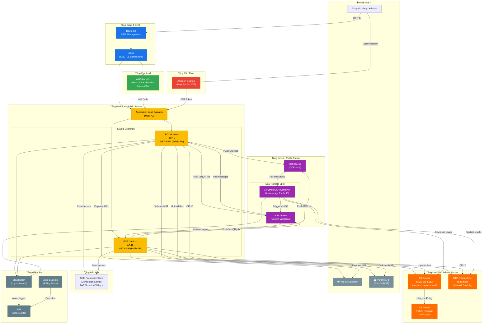
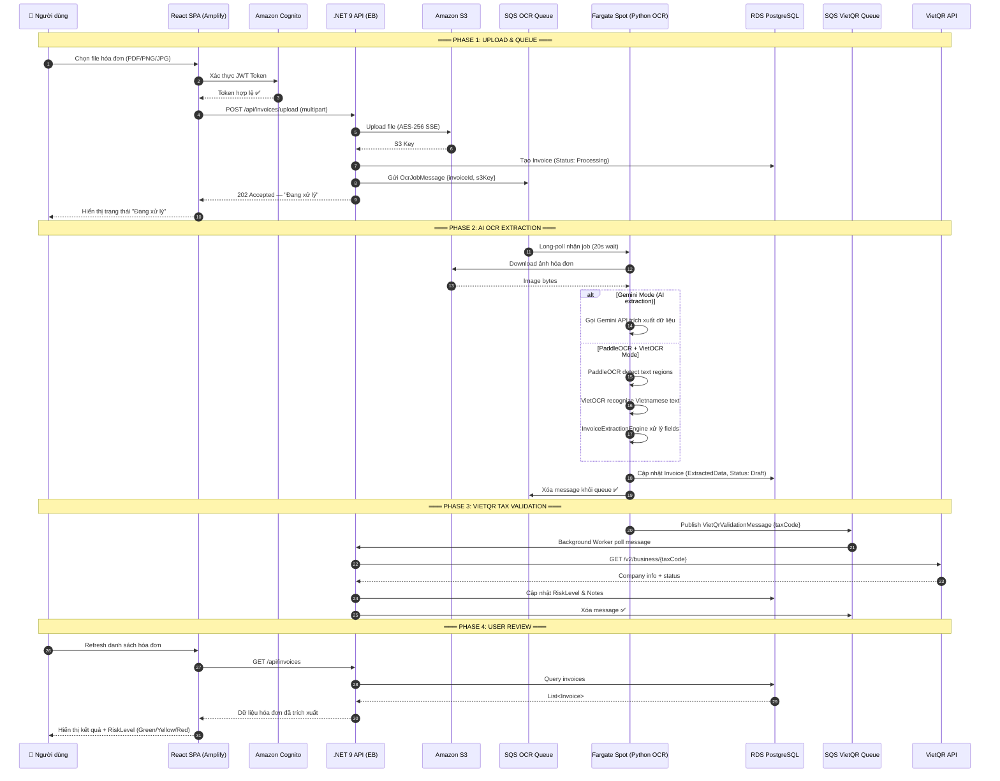
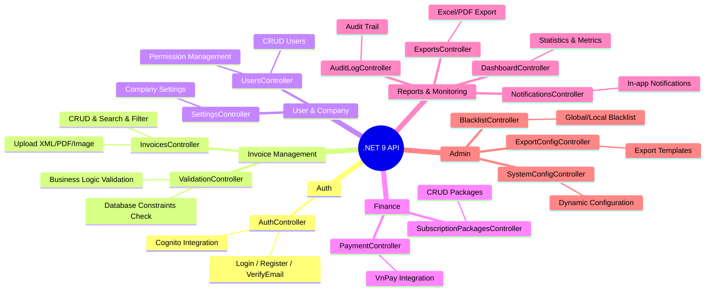
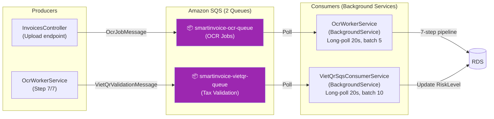
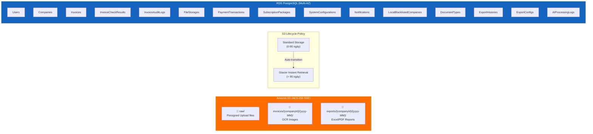
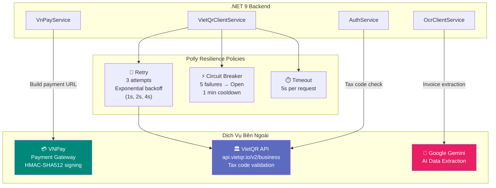
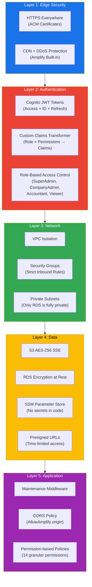

# TÀI LIỆU KIẾN TRÚC AWS TỔNG THỂ - SMARTINVOICE SHIELD

**Dự án:** Smart Invoice - Phần mềm quản lý và rà soát rủi ro hóa đơn
**Mục tiêu thiết kế:** Đảm bảo hệ thống vận hành trơn tru cho luồng xử lý hóa đơn khối lượng lớn (tích hợp AI), tuân thủ nghiêm ngặt 3 tiêu chí: **Tối ưu chi phí (Cost-Optimization)**, **Đa vùng sẵn sàng (Multi-AZ)**, và **Bảo mật lưu trữ dữ liệu (Security)**.

**Công nghệ cốt lõi:** React TS + Vite (Frontend), .NET 9 (Backend API), Python/PaddleOCR/VietOCR/Gemini (AI OCR), PostgreSQL (Database).

---

## 1. SƠ ĐỒ KIẾN TRÚC TỔNG THỂ (EVENT-DRIVEN ARCHITECTURE)

---

## 2. LUỒNG XỬ LÝ HÓA ĐƠN CHI TIẾT (SEQUENCE DIAGRAM)

---

## 3. CHI TIẾT CÁC TẦNG DỊCH VỤ (SERVICE BREAKDOWN)

### A. Tầng Giao Diện & Điều Hướng (Frontend & Edge)

| Dịch vụ | Vai trò | Chi tiết |
|---------|---------|----------|
| **AWS Amplify** | Hosting SPA | React TS + Vite, tự động phân phối qua CDN biên toàn cầu |
| **Route 53** | DNS | Quản lý domain tùy chỉnh, health check routing |
| **ACM** | SSL/TLS | Cấp chứng chỉ HTTPS tự động, zero-downtime renewal |

### B. Tầng Xác Thực & Bảo Mật (Auth & Security)

| Dịch vụ | Vai trò | Chi tiết |
|---------|---------|----------|
| **Amazon Cognito** | Identity Provider | SignUp/Login/VerifyEmail, JWT phát hành, custom attributes (`company_id`, `role`) |
| **SSM Parameter Store** | Quản lý bí mật | Connection strings, Cognito secrets, VnPay keys, SQS URLs |
| **VPC + Security Groups** | Mạng riêng | RDS trong Private Subnet. ALB, Backend, Fargate ở Public Subnet (giảm chi phí NAT) |

### C. Tầng Ứng Dụng Cốt Lõi (Core Backend)

| Dịch vụ | Vai trò | Chi tiết |
|---------|---------|----------|
| **Elastic Beanstalk** | Runtime | .NET 9 Web API, 14 Controllers, auto-deploy |
| **ALB** | Load Balancer | Phân phối traffic, health check, SSL termination |
| **Auto Scaling** | Khả dụng cao | Min 2× `t3.micro` rải đều 2 AZ, scale theo CPU |

**14 API Controllers đã triển khai:**

### D. Tầng Xử Lý Bất Đồng Bộ (Event-Driven Async)

| Thành phần | Chi tiết kỹ thuật |
|-----------|-------------------|
| **SQS OCR Queue** | Long-polling 20s, batch 5 messages, visibility timeout auto-retry |
| **SQS VietQR Queue** | Long-polling 20s, batch 10 messages, Polly retry (3×, exponential backoff) + Circuit Breaker (5 failures → 1 min break) |
| **OcrWorkerService** | 7-step pipeline: Download S3 → Call OCR API → Validate Logic → Extract Data → Create FileStorage → Update DB → Publish VietQR |
| **VietQrSqsConsumerService** | DI scope isolation per message, tax code validation, risk level escalation |
| **ECS Fargate Spot** | `python:3.10-slim`, CPU mode, Pay-As-You-Go, Scale-to-Zero khi idle |

### E. Tầng Lưu Trữ & Cơ Sở Dữ Liệu (Storage & Database)

| Dịch vụ | Chi tiết |
|---------|----------|
| **Amazon S3** | Mã hóa AES-256 (SSE), Presigned URLs (15-60 phút), 3 folder tổ chức theo companyId/date |
| **S3 Lifecycle** | Standard → Glacier Instant Retrieval sau 90 ngày |
| **RDS PostgreSQL** | Instance `db.t3.micro`, Automated Backups, PITR, 15 tables chính |

### F. Tầng Giám Sát & Quản Lý Chi Phí (Monitor & Governance)

| Dịch vụ | Vai trò |
|---------|---------|
| **CloudWatch** | Logs tập trung, Alarms (HTTP 500, CPU > threshold, SQS queue depth) |
| **SNS** | Email cảnh báo tự động cho team khi alarm trigger |
| **AWS Budgets** | Cảnh báo khẩn cấp khi chi phí vượt ngân sách cho phép |

---

## 4. TÍCH HỢP BÊN NGOÀI (EXTERNAL INTEGRATIONS)

---

## 5. SƠ ĐỒ BẢO MẬT NHIỀU TẦNG (SECURITY LAYERS)

---

## 6. LUỒNG XỬ LÝ HÓA ĐƠN TIÊU CHUẨN (HAPPY PATH)

| Bước | Hành động | Dịch vụ AWS |
|------|-----------|-------------|
| **1. Upload** | Người dùng xác thực qua Cognito, chọn file (PDF/PNG) tải lên qua Amplify | Cognito, Amplify |
| **2. Lưu trữ thô** | Request mã hóa HTTPS qua ALB → Backend API lưu file vào S3 (AES-256) | ALB, S3 |
| **3. Tạo Queue** | Backend tạo OcrJobMessage chứa S3 Key, đẩy vào SQS, phản hồi ngay "Đang xử lý" | SQS |
| **4. AI OCR** | Fargate Spot scale-up, kéo file từ S3, chạy PaddleOCR+VietOCR hoặc Gemini | ECS Fargate, S3 |
| **5. Validation** | OCR Worker validate business logic (trùng lặp, chủ sở hữu), tạo CheckResult | RDS |
| **6. VietQR** | Publish VietQR message → Background worker gọi API xác thực MST → cập nhật RiskLevel | SQS, VietQR API |
| **7. Kết quả** | Frontend poll hoặc refresh, hiển thị dữ liệu trích xuất + mức rủi ro (Green/Yellow/Red) | Amplify, RDS |

---

## 7. CHIẾN LƯỢC TỐI ƯU CHI PHÍ (COST OPTIMIZATION)

| Chiến lược | Mô tả | Tiết kiệm ước tính |
|-----------|-------|---------------------|
| **Fargate Spot** | AI OCR chạy trên tài nguyên dư thừa AWS | ~70% so với On-Demand |
| **Scale-to-Zero** | Fargate tự tắt hoàn toàn khi không có job trong SQS | 100% khi idle |
| **SQS Long Polling** | Giảm số lượng API calls (20s wait thay vì short poll) | ~90% SQS API costs |
| **S3 Lifecycle** | Auto-transition sang Glacier sau 90 ngày | ~68% storage costs |
| **t3.micro** | Burstable instances cho workload không đều | Phù hợp startup |
| **SSM Parameter Store** | Free tier (Standard parameters) | $0 cho secrets |
| **Cognito** | Free tier 50,000 MAU | $0 cho auth |
| **Amplify Free Tier** | 1000 build minutes/tháng + 15GB hosting | $0 cho frontend |
