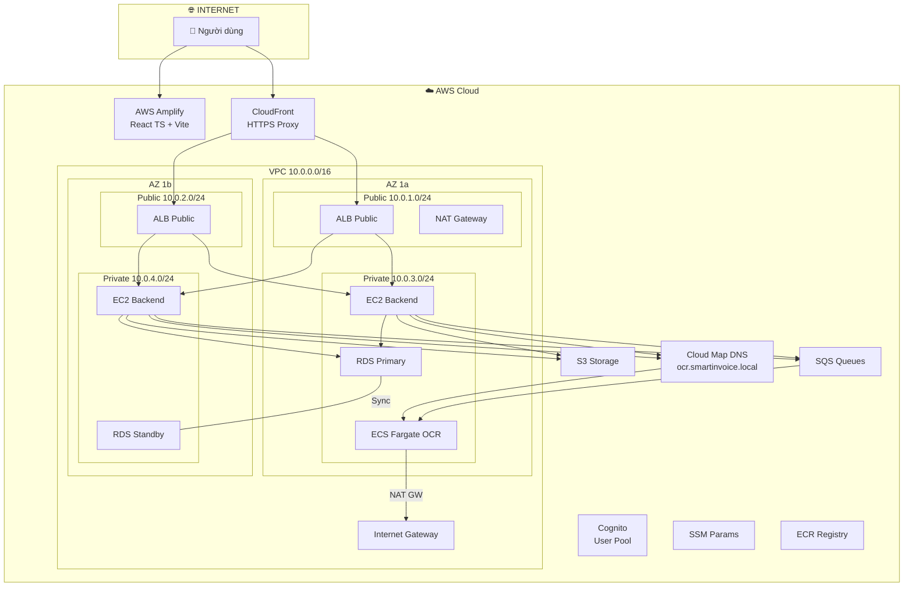

# 🛡️ Hướng Dẫn Triển Khai SmartInvoice Shield Trên AWS (End-to-End) V2

> **Phiên bản**: 2.0 | **Region**: `ap-southeast-1` (Singapore) | **Kiến trúc**: 2 AZ, Multi-AZ RDS, ALB, NAT GW, ECS Fargate


---

## Mục Lục & Thời Gian Ước Tính (~4 giờ)

| Step | Nội dung                                                                                     | ⏱️  |
| ---- | -------------------------------------------------------------------------------------------- | --- |
| 1    | [Chọn Region & Chuẩn bị](#step-1-chọn-region--chuẩn-bị)                                      | 5'  |
| 2    | [Tạo VPC & Subnets](#step-2-tạo-vpc--subnets)                                                | 15' |
| 3    | [Tạo Internet Gateway](#step-3-tạo-internet-gateway)                                         | 5'  |
| 4    | [Tạo NAT Gateway](#step-4-tạo-nat-gateway)                                                   | 10' |
| 5    | [Tạo Route Tables](#step-5-tạo-route-tables)                                                 | 10' |
| 6    | [Tạo Security Groups](#step-6-tạo-security-groups)                                           | 15' |
| 7    | [Tạo IAM Roles](#step-7-tạo-iam-roles)                                                       | 15' |
| 8    | [Tạo S3 Bucket](#step-8-tạo-s3-bucket)                                                       | 5'  |
| 9    | [Tạo Amazon Cognito](#step-9-tạo-amazon-cognito)                                             | 15' |
| 10   | [Tạo SQS Queues](#step-10-tạo-sqs-queues)                                                    | 10' |
| 11   | [Tạo SSM Parameter Store](#step-11-tạo-ssm-parameter-store)                                  | 15' |
| 12   | [Tạo RDS PostgreSQL](#step-12-tạo-rds-postgresql)                                            | 15' |
| 13   | [Tạo ECR & Push Docker Images](#step-13-tạo-ecr--push-docker-images)                         | 20' |
| 14   | [Triển khai OCR (ECS Fargate)](#step-14-triển-khai-ocr-trên-ecs-fargate)                     | 20' |
| 15   | [Triển khai Backend (Elastic Beanstalk)](#step-15-triển-khai-backend-trên-elastic-beanstalk) | 20' |
| 16   | [Cấu hình HTTPS (CloudFront)](#step-16-cấu-hình-https-cloudfront)                            | 15' |
| 17   | [Triển khai Frontend (Amplify)](#step-17-triển-khai-frontend-trên-amplify)                   | 10' |
| 18   | [CI/CD (GitHub Actions)](#step-18-cấu-hình-cicd)                                             | 10' |
| 19   | [CloudWatch Monitoring](#step-19-cloudwatch-monitoring)                                      | 15' |
| 20   | [Kiểm tra End-to-End](#step-20-kiểm-tra-end-to-end)                                          | 15' |

---

## Sơ Đồ Kiến Trúc



### Bảng Subnet

| Subnet                    | CIDR          | AZ  | Loại    | Chứa                                |
| ------------------------- | ------------- | --- | ------- | ----------------------------------- |
| `smartinvoice-public-1a`  | `10.0.1.0/24` | 1a  | Public  | ALB Public, NAT GW                  |
| `smartinvoice-public-1b`  | `10.0.2.0/24` | 1b  | Public  | ALB Public                          |
| `smartinvoice-private-1a` | `10.0.3.0/24` | 1a  | Private | EC2 Backend, RDS Primary, ECS Fargate |
| `smartinvoice-private-1b` | `10.0.4.0/24` | 1b  | Private | EC2 Backend, RDS Standby            |

---

## Step 1: Chọn Region & Chuẩn Bị

1. Đăng nhập **AWS Console**: https://console.aws.amazon.com
2. Góc trên phải → chọn **Asia Pacific (Singapore) `ap-southeast-1`**

> [!WARNING]
> Tất cả bước tiếp theo phải ở Region `ap-southeast-1`. Kiểm tra lại trước mỗi bước!

```bash
# Kiểm tra CLI
aws --version        # Cần v2.x
docker --version
aws sts get-caller-identity
```

---

## Step 2: Tạo VPC & Subnets

### 2.1. Tạo VPC

**Console**: VPC Dashboard → **Your VPCs** → **Create VPC**

| Trường              | Giá trị            |
| ------------------- | ------------------ |
| Resources to create | **VPC and more**   |
| Name tag            | `smartinvoice-vpc` |
| IPv4 CIDR           | `10.0.0.0/16`      |
| Tenancy             | Default            |

### 2.2. Tạo 4 Subnets

**Console**: VPC → **Subnets** → **Create subnet** (nhấn **Add new subnet** để tạo cùng lúc)

| #   | Name                      | AZ                | CIDR          |
| --- | ------------------------- | ----------------- | ------------- |
| 1   | `smartinvoice-public-1a`  | `ap-southeast-1a` | `10.0.1.0/24` |
| 2   | `smartinvoice-public-1b`  | `ap-southeast-1b` | `10.0.2.0/24` |
| 3   | `smartinvoice-private-1a` | `ap-southeast-1a` | `10.0.3.0/24` |
| 4   | `smartinvoice-private-1b` | `ap-southeast-1b` | `10.0.4.0/24` |

### 2.3. Bật Auto-assign Public IP

Cho **mỗi public subnet**: Actions → Edit subnet settings → ✅ Enable auto-assign public IPv4

---

## Step 3: Tạo Internet Gateway

**Console**: VPC → **Internet Gateways** → **Create internet gateway**

| Name tag | `smartinvoice-igw` |
| -------- | ------------------ |

→ **Actions** → **Attach to VPC** → `smartinvoice-vpc` → **Attach** ✅

---

## Step 4: Tạo NAT Gateway

> NAT Gateway cho phép Private Subnet truy cập Internet (outbound). Chi phí ~$32/tháng.

**Console**: VPC → **NAT Gateways** → **Create NAT gateway**

| Trường       | Giá trị                                             |
| ------------ | --------------------------------------------------- |
| Name         | `smartinvoice-nat-gw`                               |
| Subnet       | `smartinvoice-public-1a` ⚠️ (phải ở Public Subnet!) |
| Connectivity | Public                                              |
| Elastic IP   | Click **Allocate Elastic IP**                       |

Chờ status `Available` (2-3 phút)

---

## Step 5: Tạo Route Tables

### 5.1. Public Route Table

**Console**: VPC → **Route Tables** → **Create route table**

| Name                     | VPC                |
| ------------------------ | ------------------ |
| `smartinvoice-public-rt` | `smartinvoice-vpc` |

**Routes** → Edit → Add: `0.0.0.0/0` → Target: `smartinvoice-igw`

**Subnet associations**: tick `smartinvoice-public-1a` + `smartinvoice-public-1b`

### 5.2. Private Route Table

| Name                      | VPC                |
| ------------------------- | ------------------ |
| `smartinvoice-private-rt` | `smartinvoice-vpc` |

**Routes** → Add: `0.0.0.0/0` → Target: `smartinvoice-nat-gw`

**Subnet associations**: tick `smartinvoice-private-1a` + `smartinvoice-private-1b`

---

## Step 6: Tạo Security Groups

**Console**: VPC → **Security Groups** → **Create security group** (VPC: `smartinvoice-vpc`)

### SG 1: ALB (`smartinvoice-alb-sg`)

| Inbound | Port | Source      |
| ------- | ---- | ----------- |
| HTTP    | 80   | `0.0.0.0/0` |
| HTTPS   | 443  | `0.0.0.0/0` |

### SG 2: Backend (`smartinvoice-backend-sg`)

| Inbound     | Port | Source                |
| ----------- | ---- | --------------------- |
| Custom TCP  | 80   | `smartinvoice-alb-sg` |
| Custom TCP  | 8080 | `smartinvoice-alb-sg` |
| All Traffic | All  | Self (same SG)        |

### SG 3: RDS (`smartinvoice-rds-sg`)

| Inbound    | Port | Source                    |
| ---------- | ---- | ------------------------- |
| PostgreSQL | 5432 | `smartinvoice-backend-sg` |
| PostgreSQL | 5432 | `smartinvoice-ocr-sg`     |

### SG 4: OCR (`smartinvoice-ocr-sg`)

| Inbound    | Port | Source                                    |
| ---------- | ---- | ----------------------------------------- |
| Custom TCP | 5000 | `smartinvoice-backend-sg` (Gọi trực tiếp) |

> Tất cả SG: **Outbound** = All traffic → `0.0.0.0/0`

---

## Step 7: Tạo IAM Roles (Hướng dẫn chi tiết)

Để hệ thống SmartInvoice Shield hoạt động ổn định và bảo mật, bạn cần tạo **4 IAM Roles** chính. Quy trình chung cho mỗi Role như sau:

**Quy trình chung tạo Role trên Console:**

1. Truy cập **IAM Console** → Sidebar chọn **Roles** → Click **Create role**.
2. **Step 1: Select trusted entity**:
   - Trusted entity type: Chọn **AWS service**.
   - Service or use case: Chọn dịch vụ tương ứng (vd: `EC2` hoặc `Elastic Container Service`).
   - Use case: Chọn mục cụ thể như trong ảnh (vd: `EC2` cho Elastic Beanstalk).
   - Nhấn **Next**.
3. **Step 2: Add permissions**:
   - Tìm kiếm tên Policy trong thanh search.
   - Tick chọn Policy tương ứng.
   - Nhấn **Next**.
4. **Step 3: Name, review, and create**:
   - Nhập **Role name** chính xác.
   - Nhấn **Create role** ✅.

---

### 7.1. Role cho Elastic Beanstalk (`aws-elasticbeanstalk-ec2-role`)

_Role này gắn vào các máy chủ EC2 để Backend có quyền truy cập các tài nguyên AWS khác._

- **Trusted entity**: `AWS service`
- **Service**: `Elastic Beanstalk`
- **Use case**: `Elastic Beanstalk - Compute` (Quan trọng: Đây là tùy chọn cấp quyền cho các máy chủ EC2 trong môi trường)
- Nhấn **Next**
- Chọn **Use a permissions boundary to control the maximum role permissions**
- Tìm kiếm và chọn các policies sau:
  - `AmazonS3FullAccess`
  - `AmazonSQSFullAccess`
  - `AmazonCognitoPowerUser`
  - `AmazonSSMReadOnlyAccess`
  - `AmazonEC2ContainerRegistryReadOnly`
  - `CloudWatchLogsFullAccess`

---

### 7.2. Service Role cho EB (`aws-elasticbeanstalk-service-role`)

_Role này cho phép Elastic Beanstalk thay mặt bạn gọi các dịch vụ AWS._

- **Trusted entity**: `AWS service`
- **Service**: `Elastic Beanstalk`
- **Use case**: `Elastic Beanstalk - Environment`
- **Policies**: (AWS tự động gắn các policies cần thiết)
  - `AWSElasticBeanstalkEnhancedHealth`
  - `AWSElasticBeanstalkManagedUpdatesCustomerRolePolicy`

---

### 7.3. ECS Execution Role (`ecsTaskExecutionRole`)

_Role này dùng để ECS Fargate có quyền kéo image từ ECR và ghi log lên CloudWatch._

- **Trusted entity**: `AWS service`
- **Service/Use case**: `Elastic Container Service` → `Elastic Container Service Task`
- **Policies**:
  - `AmazonECSTaskExecutionRolePolicy`
  - `CloudWatchLogsFullAccess`

---

### 7.4. ECS Task Role cho OCR (`smartinvoice-ecs-task-role`)

_Role này cấp quyền trực tiếp cho ứng dụng OCR chạy trong Container._

- **Trusted entity**: `AWS service`
- **Service/Use case**: `Elastic Container Service` → `Elastic Container Service Task`
- **Policies**:
  - `AmazonS3FullAccess`
  - `AmazonSQSFullAccess`
  - `AmazonSSMReadOnlyAccess`

---

## Step 8: Tạo S3 Bucket

**Console**: S3 → **Create bucket**

| Trường                      | Giá trị                        |
| --------------------------- | ------------------------------ |
| Bucket name                 | `smart-invoice-shield-storage` |
| Region                      | `ap-southeast-1`               |
| **Block all public access** | ✅ **Block all**               |
| Default encryption          | SSE-S3                         |

> [!CAUTION]
> KHÔNG bật Public Access. File hóa đơn chỉ truy cập qua Presigned URL.

---

## Step 9: Tạo Amazon Cognito

### 9.1. Tạo User Pool

**Console**: Cognito → **Create user pool**

| Trường              | Giá trị                       |
| ------------------- | ----------------------------- |
| Application type    | `Traditional web application` |
| App client name     | `smart-invoice`               |
| Sign-in identifiers | **Email**                     |
| Self-registration   | ✅ Enable                     |
| Required attributes | `email`                       |

### 9.2. Thêm Custom Attributes

User Pool → Authentication → Sign-up → **Add custom attributes**: `company_id` (String), `role` (String) → Save

### 9.3. Bật Password Auth

App clients → `smart-invoice` → Edit → ✅ `ALLOW_USER_PASSWORD_AUTH` → Save

### 9.4. Ghi lại thông tin

| Thông tin         | Nơi tìm                         |
| ----------------- | ------------------------------- |
| **User Pool ID**  | Overview (`ap-southeast-1_XXX`) |
| **Client ID**     | App clients                     |
| **Client Secret** | App clients → Show              |

---

## Step 10: Tạo SQS Queues

### Queue 1: OCR

| Trường                    | Giá trị                  |
| ------------------------- | ------------------------ |
| Type                      | Standard                 |
| Name                      | `smartinvoice-ocr-queue` |
| Visibility timeout        | `450` seconds            |
| Receive message wait time | `20` seconds             |

### Queue 2: VietQR

| Trường                    | Giá trị                     |
| ------------------------- | --------------------------- |
| Type                      | Standard                    |
| Name                      | `smartinvoice-vietqr-queue` |
| Visibility timeout        | `30` seconds                |
| Receive message wait time | `20` seconds                |

→ Ghi lại **Queue URL** cho cả 2

---

## Step 11: Tạo SSM Parameter Store

**Console**: Systems Manager → **Parameter Store** → **Create parameter**

| Parameter name                             | Type             | Value                                           |
| ------------------------------------------ | ---------------- | ----------------------------------------------- |
| `/SmartInvoice/prod/COGNITO_USER_POOL_ID`  | String           | (Step 9)                                        |
| `/SmartInvoice/prod/COGNITO_CLIENT_ID`     | String           | (Step 9)                                        |
| `/SmartInvoice/prod/COGNITO_CLIENT_SECRET` | **SecureString** | (Step 9)                                        |
| `/SmartInvoice/prod/AWS_SQS_OCR_URL`       | String           | (Step 10 — OCR queue URL)                       |
| `/SmartInvoice/prod/AWS_SQS_URL`           | String           | (Step 10 — VietQR queue URL)                    |
| `/SmartInvoice/prod/POSTGRES_HOST`         | String           | (Step 12 — RDS endpoint)                        |
| `/SmartInvoice/prod/POSTGRES_PORT`         | String           | `5432`                                          |
| `/SmartInvoice/prod/POSTGRES_DB`           | String           | `SmartInvoiceDb`                                |
| `/SmartInvoice/prod/POSTGRES_USER`         | String           | `postgres`                                      |
| `/SmartInvoice/prod/POSTGRES_PASSWORD`     | **SecureString** | (RDS password)                                  |
| `/SmartInvoice/prod/AWS_REGION`            | String           | `ap-southeast-1`                                |
| `/SmartInvoice/prod/AWS_S3_BUCKET_NAME`    | String           | `smart-invoice-shield-storage`                  |
| `/SmartInvoice/prod/OCR_API_ENDPOINT`      | String           | `http://ocr.smartinvoice.local:5000` (Step 14) |
| `/SmartInvoice/prod/ALLOWED_ORIGINS`       | String           | (cập nhật sau Step 17)                          |

---

## Step 12: Tạo RDS PostgreSQL

### 12.1. DB Subnet Group

**Console**: RDS → **Subnet groups** → **Create**: Name `smartinvoice-db-subnet-group`, VPC `smartinvoice-vpc`, Subnets: 2 private subnets

### 12.2. Create Database

| Trường                            | Giá trị                         |
| --------------------------------- | ------------------------------- |
| Engine                            | PostgreSQL 16.x                 |
| Choose a database creation method | Full configuration              |
| Template                          | Free tier / Dev-Test            |
| Deployment options                | Multi-AZ DB instance deployment |
| DB identifier                     | `smartinvoice-db`               |
| Master username                   | `postgres`                      |
| Credentials management            | Self managed                    |
| Master password                   | [PASSWORD]                      |
| Instance class                    | `db.t3.micro`                   |
| Storage                           | 20 GB gp3                       |
| VPC                               | `smartinvoice-vpc`              |
| Subnet group                      | `smartinvoice-db-subnet-group`  |
| Public access                     | ❌ No                           |
| Security group                    | `smartinvoice-rds-sg`           |
| Initial DB name                   | `SmartInvoiceDb`                |
| Backup retention                  | 7 days                          |

→ Chờ 5-10 phút → Ghi lại **Endpoint** → Cập nhật SSM `POSTGRES_HOST`

---

## Step 13: Tạo ECR & Push Docker Images (Cấu hình Máy local)

Bước này yêu cầu máy tính của bạn phải sẵn sàng các công cụ để đóng gói và đưa ứng dụng lên AWS.

### 13.1. Chuẩn bị Công cụ

Nếu máy bạn chưa có, hãy cài đặt các công cụ sau:

1. **AWS CLI v2**: [Tải tại đây](https://aws.amazon.com/cli/). Sau khi cài, mở Terminal gõ `aws --version` để kiểm tra.
2. **Docker Desktop**: [Tải tại đây](https://www.docker.com/products/docker-desktop/). Đảm bảo Docker đang chạy (biểu tượng cá voi ở thanh taskbar).

### 13.2. Cấu hình AWS CLI (Đăng nhập)

Để máy của bạn có quyền thao tác với AWS, bạn cần cấu hình Access Key:

1. Mở Terminal và gõ:
   ```bash
   aws configure
   ```
2. Nhập các thông tin sau:
   - **AWS Access Key ID**: (Lấy từ IAM User của bạn)
   - **AWS Secret Access Key**: (Lấy từ IAM User của bạn)
   - **Default region name**: `ap-southeast-1`
   - **Default output format**: `json`

### 13.3. Tạo Repositories trên ECR

Bạn cần tạo "kho chứa" cho ảnh Docker trên AWS:

```bash
aws ecr create-repository --repository-name smartinvoice-backend --region ap-southeast-1
aws ecr create-repository --repository-name smartinvoice-ocr --region ap-southeast-1
```

_(Hoặc tạo thủ công trên Console: ECR -> Repositories -> Create repository)_

### 13.4. Đăng nhập Docker vào AWS ECR

Trước khi đẩy file lên, Docker cần xác thực với AWS. Thay `<ACCOUNT_ID>` bằng 12 số ID tài khoản AWS của bạn (xem ở góc trên phải Console):

```bash
aws ecr get-login-password --region ap-southeast-1 | \
  docker login --username AWS --password-stdin <ACCOUNT_ID>.dkr.ecr.ap-southeast-1.amazonaws.com
```

### 13.5. Build & Push chi tiết

#### A. Đối với Backend (.NET 9)

```bash
# 1. Di chuyển vào thư mục code API
cd SmartInvoice.API

# 2. Build ảnh Docker (Đặt tên là smartinvoice-backend)
docker build -t smartinvoice-backend .

# 3. Gắn thẻ (Tag) để khớp với kho chứa trên AWS
docker tag smartinvoice-backend:latest <ACCOUNT_ID>.dkr.ecr.ap-southeast-1.amazonaws.com/smartinvoice-backend:latest

# 4. Đẩy (Push) lên AWS
docker push <ACCOUNT_ID>.dkr.ecr.ap-southeast-1.amazonaws.com/smartinvoice-backend:latest
```

#### B. Đối với OCR (Python)

Lưu ý: Ảnh OCR khá nặng (~2-3 GB), hãy đảm bảo mạng ổn định.

```bash
# 1. Di chuyển vào thư mục ocr
cd ../invoice_ocr

# 2. Build ảnh Docker
docker build -t smartinvoice-ocr .

# 3. Gắn thẻ
docker tag smartinvoice-ocr:latest <ACCOUNT_ID>.dkr.ecr.ap-southeast-1.amazonaws.com/smartinvoice-ocr:latest

# 4. Đẩy lên AWS
docker push <ACCOUNT_ID>.dkr.ecr.ap-southeast-1.amazonaws.com/smartinvoice-ocr:latest
```

> [!TIP]
> Nếu bạn gặp lỗi "Permission Denied" khi push, hãy kiểm tra xem IAM User của bạn đã có quyền `AmazonEC2ContainerRegistryFullAccess` chưa.

---

## Step 14: Triển Khai OCR Trên ECS Fargate

### 14.1. Tạo Cluster

ECS → Clusters → Create: `smartinvoice-cluster`, Infrastructure: **Fargate only**

### 14.2. Task Definition

| Trường                        | Giá trị                                       |
| ----------------------------- | --------------------------------------------- |
| Family                        | `smartinvoice-ocr-task`                       |
| Launch type                   | AWS Fargate                                   |
| Operating system/Architecture | Linux/X86_64                                  |
| CPU                           | `2 vCPU`,                                     |
| Memory                        | `4 GB`                                        |
| Task role                     | `smartinvoice-ecs-task-role`                  |
| Execution role                | `ecsTaskExecutionRole`                        |
| Container                     | `ocr-container`, Image: ECR URI, Port: `5000` |
| Environment                   | `DEVICE=cpu`, `HOST=0.0.0.0`, `PORT=5000`     |
| Logs                          | `awslogs` → `/ecs/smartinvoice-ocr-task`      |

### 14.3. Tạo Cloud Map Namespace (Nếu chưa có)

> Cloud Map giúp các dịch vụ gọi nhau bằng tên miền nội bộ (VD: `ocr.smartinvoice.local`) giúp tiết kiệm chi phí Load Balancer (~$18/tháng).

**Console**: AWS Cloud Map → **Create namespace**

| Trường            | Giá trị                                      |
| ----------------- | -------------------------------------------- |
| Namespace name    | `smartinvoice.local`                         |
| Instance discovery | `API calls and DNS queries in VPCs` (Private) |
| VPC               | `smartinvoice-vpc`                           |

### 14.4. Cấu hình Service Discovery cho OCR

Khi tạo Service ở bước tiếp theo, bạn sẽ kết nối nó với Namespace này. Sau khi hoàn tất, AWS sẽ tự động gán IP của các Task vào tên miền `ocr.smartinvoice.local`.

### 14.5. Triển khai Service trên ECS (Chi tiết Console)

**Console**: ECS → Clusters → `smartinvoice-cluster` → **Services** → **Create**

#### A. Compute configuration

- **Compute options**: `Capacity provider strategy`
- **Strategy**: `Use custom (Advanced)` -> **Fargate** (Weight: 1, Base: 0)

#### B. Deployment configuration

- **Application type**: `Service`
- **Task definition**: Family `smartinvoice-ocr-task` (LATEST)
- **Service name**: `smartinvoice-ocr-task-service`
- **Desired tasks**: `2` (Tăng lên 2 để chạy song song)
- **Deployment controller**: `Rolling update`

#### C. Networking

- **VPC**: `smartinvoice-vpc`
- **Subnets**: Chọn cả 2 **Private** subnets (1a, 1b)
- **Security group**: `Use an existing security group` -> Chọn `ocr-sg`
- **Public IP**: ❌ **Turned off** (Bắt buộc vì nằm trong Private Subnet)

#### D. Load balancing & Service discovery

- **Load balancing**: Chọn 🔵 **None** (Để tiết kiệm chi phí).
- **Service discovery**:
  - **Use service discovery**: ✅ (Tick chọn).
  - **Namespace**: Chọn `smartinvoice.local` (Đã tạo ở bước 14.3).
  - **Service name**: Nhập `ocr`.
  - **DNS record type**: Chọn `A` record.
  - **TTL**: `15` / `60` seconds.

→ Sau khi Service ở trạng thái `Running`, hãy cập nhật tham số `/SmartInvoice/prod/OCR_API_ENDPOINT` trong SSM thành `http://ocr.smartinvoice.local:5000`.

---

## Step 15: Triển Khai Backend Trên Elastic Beanstalk (Chi tiết Console)

Việc tạo môi trường Elastic Beanstalk (EB) sẽ trải qua 6 bước trên giao diện AWS. Dưới đây là các giá trị bạn cần điền khớp với ảnh chụp màn hình:

### 15.1. Bước 1: Configure environment

- **Environment tier**: `Web server environment`
- **Application name**: `Smartinvoice-api`
- **Environment name**: `Smartinvoice-api-env`
- **Platform**: `Docker`
- **Platform branch**: `Docker running on 64bit Amazon Linux 2023`
- **Application code**: Chọn `Sample application` (Để tạo môi trường trước, sau này CI/CD sẽ đẩy code sau).
- **Presets**: Chọn `Single instance`

### 15.2. Bước 2: Configure service access

- **Service role**: Chọn `aws-elasticbeanstalk-service-role` (Nếu chưa có hãy nhấn Create role).
- **EC2 instance profile**: Chọn `aws-elasticbeanstalk-ec2-role`.
- **Key pair**: Có thể bỏ qua hoặc chọn key của bạn để SSH vào instance nếu cần.

### 15.3. Bước 3: Set up networking, database, and tags

- **VPC**: Chọn `smartinvoice-vpc` (ID: `vpc-09b1...`).
- **Public IP address**: ❌ Không tick **Enable**.
- **Instance subnets**: Tick chọn 2 subnet **Private** (`1a` và `1b`). ⚠️ _Đây là nơi đặt EC2 chạy Backend._


### 15.4. Bước 4: Configure instance traffic and scaling

- **Root volume**: `Container default`.
- **IMDSv1**: Tick chọn **Disable**.
- **EC2 security groups**: Chọn `smartinvoice-backend-sg`
- **Capacity**:
  - **Environment type**: `single instance`
  - **Instances**: `t3.micro`.
- **Scaling policy**: Nhập Min: `2`, Max: `4` (Để hệ thống tự tăng giảm).

### 15.5. Bước 5: Configure updates, monitoring, and logging

- **Monitoring**: `Basic` (Hoặc `Enhanced` nếu muốn xem chi tiết hơn).

### 15.6. Bước 6: Review & Create

Nhấn **Submit** và đợi 5-10 phút để môi trường được khởi tạo.

---

### Step 15.7: File cấu hình Dockerrun.aws.json

Sau khi môi trường đã sẵn sàng, file này sẽ được dùng bởi GitHub Actions (Bước 18) để triển khai code từ ECR:

```json
{
  "AWSEBDockerrunVersion": "1",
  "Image": {
    "Name": "<ACCOUNT_ID>.dkr.ecr.ap-southeast-1.amazonaws.com/smartinvoice-backend:latest",
    "Update": "true"
  },
  "Ports": [
    {
      "ContainerPort": 8080,
      "HostPort": 80
    }
  ]
}
```

---

## Step 16: Cấu Hình HTTPS Với CloudFront (Proxy cho Backend)

CloudFront sẽ đóng vai trò làm cổng HTTPS công khai cho Backend API.

### 16.1. Bước 1 & 2: Get started

- **Distribution name**: `smartinvoice-backend-proxy`.
- **Distribution type**: `Single website or app`.

### 16.2. Bước 3: Specify origin

- **Origin type**: Chọn **Elastic Load Balancer**.
- **Origin domain**: Chọn đúng DNS Name của **Elastic Beanstalk ALB** (Ví dụ: `awseb-e-m-AWSEBLoa-xxxx.ap-southeast-1.elb.amazonaws.com`).
- **Origin settings -> Customize origin settings**:
  - **Protocol**: `HTTP only` và **HTTP Port**: `80`.

### 16.3. Bước 4: Default cache behavior

- **Viewer protocol policy**: `Redirect HTTP to HTTPS` (Bắt buộc để bảo mật).
- **Allowed HTTP methods**: `GET, HEAD, OPTIONS, PUT, POST, PATCH, DELETE`.
- **Cache key and origin requests -> Customize cache settings**:
  - **Cache policy**: `CachingDisabled`.
  - **Origin request policy**: Chọn `AllViewerExceptHostHeader`.
  - **Response headers policy**: Chọn `CORS-With-Preflight`.


### 16.4. Bước 5 & 6: Enable Security & Review

- **Rate limiting**: Tick chọn (Recommended) để chống spam API.

---

## Step 17: Triển Khai Frontend Trên Amplify

### 17.1. Connect Branch

1. **Console**: AWS Amplify → **All apps** → **New app** → **Host web app**.
2. Kết nối GitHub Repository `tuankiet18-dev/SMARTINVOICE-SHIELD`, chọn Branch `main`.

### 17.2. Build settings (amplify.yml)

Amplify sẽ tự nhận diện Vite. Kiểm tra App settings -> Build settings:

```yaml
version: 1
frontend:
  phases:
    preBuild:
      commands:
        - npm install
    build:
      commands:
        - npm run build
  artifacts:
    baseDirectory: dist
    files:
      - "**/*"
  cache:
    paths:
      - node_modules/**/*
```

### 17.3. Environment Variables

Tại **App settings** → **Environment variables**, thêm:

- `VITE_API_URL`: Dán domain CloudFront ở Bước 16 (Ví dụ: `https://d3xxxx.cloudfront.net/api`).

---

## Step 18: Cấu Hình GitHub Actions (CI/CD)

### 18.1. GitHub Secrets

Vào Repo GitHub -> Settings -> Secrets and variables -> Actions, thêm:
| Secret | Value |
| ----------------------- | ------------------- |
| `AWS_ACCESS_KEY_ID` | IAM Access Key |
| `AWS_SECRET_ACCESS_KEY` | IAM Secret Key |
| `AWS_REGION` | `ap-southeast-1` |
| `AWS_ACCOUNT_ID` | 12-digit Account ID |

### 18.2. Kích hoạt Workflow

Đẩy code lên branch `main`, GitHub Actions sẽ tự động:

1. Build Docker image Backend & OCR → Đẩy lên ECR.
2. Cập nhật Elastic Beanstalk (Backend) & ECS Service (OCR).

---

## Step 19: CloudWatch Monitoring & Alarms

### 19.1. Thiết lập Cảnh báo (SNS)

1. SNS → Create topic `smartinvoice-alerts` → Subscribe Email của bạn.

### 19.2. CloudWatch Alarms

| Alarm               | Điều kiện                | Hành động    |
| ------------------- | ------------------------ | ------------ |
| OCR Tasks Down      | `RunningTaskCount < 1`   | Gửi mail SNS |
| API 5xx Errors high | `5xxError > 5 (1 min)`   | Gửi mail SNS |
| RDS Storage Low     | `FreeStorageSpace < 5GB` | Gửi mail SNS |

---

## Step 20: Kiểm Tra Tổng Thể (Smoke Test)

| STT | Kiểm tra             | Kết quả mong đợi                     |
| --- | -------------------- | ------------------------------------ |
| 1   | Truy cập Frontend    | Trang Login hiển thị                 |
| 2   | Đăng ký / Đăng nhập  | Nhận email OTP, vào được Dashboard   |
| 3   | Upload Hóa đơn       | Status chuyển từ Processing -> Draft |
| 4   | Xem Chi tiết hóa đơn | Thông tin (MST, Ngày, Tiền) đầy đủ   |
| 5   | Kiểm tra RiskLevel   | Hiển thị cảnh báo rủi ro (nếu có)    |

---

## 💰 Chi Phí Ước Tính (Monthly)

| Dịch vụ        | Cấu hình dự kiến     | Chi phí ($) |
| -------------- | -------------------- | ----------- |
| EC2 (EBS)      | 2x t3.micro          | ~$15        |
| RDS PostgreSQL | db.t3.micro Multi-AZ | ~$28        |
| ECS Fargate    | 2 tasks (0.25 vCPU)  | ~$20        |
| NAT Gateway    | 1 zone + data        | ~$35        |
| ALB (Backend)  | 1 ALB                | ~$18        |
| **TỔNG CỘNG**  |                      | **~$116**   |

> [!TIP]
> Để xóa toàn bộ tài nguyên tránh phát sinh phí sau khi test: Xóa **CloudFront**, **Amplify**, **Elastic Beanstalk Environment**, **ECS Service**, **RDS**, và cuối cùng là **NAT Gateway**.
